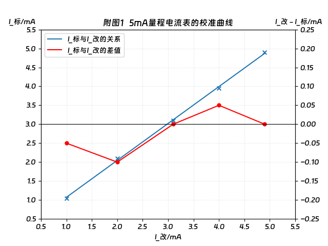
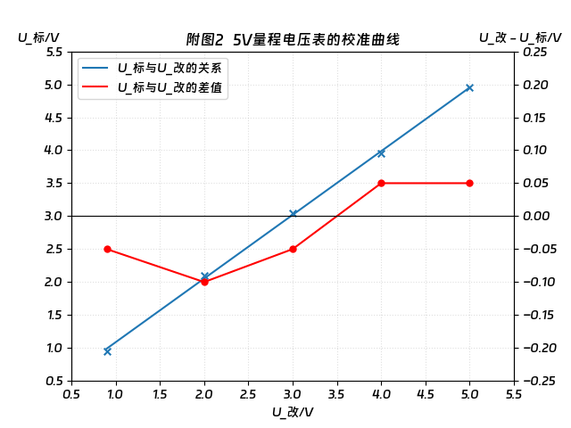
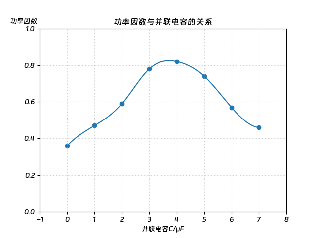

# 大学物理实验

!!! tip "说明"

    此文档正在更新中……

## 课程介绍

!!! info "注意"

    此为 2024-2025 秋冬学期课程安排，仅供参考

xt老师 (1)
{.annotate}

1. 实际上做不同的实验，授课老师是不同的

实验报告如果要附纸的话，裁剪至合适大小，再用胶棒之类的把附纸粘在实验报告的相应位置。如果需要画图的话，可以使用 matlab、origin、excel 等软件画图

我是用 python 画的图，下文中会提供相应实验画图的 python 代码，这样同学们只需要更改一下实验数据，就能很方便地得到自己的图 (1) 
{.annotate}

1. 当然前提是你电脑上下载了 python 和相应的库

!!! tip "python 代码说明"

    我的某些图使用了 ^^钉钉进步体^^，对应的代码行为

    ```python
    plt.rcParams['font.sans-serif'] = ['DingTalk JinBuTi']
    ```

    若要修改字体，请修改此代码行。例如修改为 ^^黑体^^

    ```python
    plt.rcParams['font.sans-serif'] = ['SimHei']
    ```
    
    若遇到负号等符号无法显示的情况，尝试添加以下代码行

    ```python
    plt.rcParams['axes.unicode_minus'] = False
    ```

    若仍无法解决问题，可以复制报错信息至浏览器，上网搜索解决

### 课程须知

<embed src="../../../file/phy_exp/phy_exp_doc1.pdf" type="application/pdf" width="100%" height="500">

## 我的课表

<table>
  <thead>
    <tr>
      <th id="tab-both-mid">实验名称</th>
      <th style="text-align: center; vertical-align: middle;">指导教师</th>
      <th style="text-align: center; vertical-align: middle;">操作难易程度</th>
      <th style="text-align: center; vertical-align: middle;">说明</th>
      <th style="text-align: center; vertical-align: middle;">得分</th>
      <th style="text-align: center; vertical-align: middle;">备注</th>
    </tr>
  </thead>
  <tbody>
    <tr>
      <td style="text-align: center; vertical-align: middle;">万用表的设计</td>
      <td style="text-align: center; vertical-align: middle;">pbl老师</td>
      <td style="text-align: center; vertical-align: middle;">简单<br/>费时短</td>
      <td></td>
      <td style="text-align: center; vertical-align: middle;">98</td>
      <td></td>
    </tr>
    <tr>
      <td style="text-align: center; vertical-align: middle;">交流电路功率因数实验<br/>▲弗兰克赫兹实验</td>
      <td style="text-align: center; vertical-align: middle;">lyh老师</td>
      <td style="text-align: center; vertical-align: middle;">简单<br/>费时短</td>
      <td style="vertical-align: middle;">1. 同时做两个实验<br/>2. 两份实验报告要分开写<br/>3. 交流电路老师已经搭好了，只需要按开关，记录数据即可</td>
      <td style="text-align: center; vertical-align: middle;">91</td>
      <td style="vertical-align: middle;">应该是【数据处理与结果】这部分扣分了</td>
    </tr>
    <tr>
      <td style="text-align: center; vertical-align: middle;">分光计的调整和使用</td>
      <td style="text-align: center; vertical-align: middle;">jll老师</td>
      <td style="text-align: center; vertical-align: middle;">中等<br/>费时中等</td>
      <td style="vertical-align: middle;">1. <strong>必做</strong> 实验<br/>2. 如果书上的操作看不懂，可以去B站搜视频</td>
      <td style="text-align: center; vertical-align: middle;">94</td>
      <td></td>
    </tr>
    <tr>
      <td style="text-align: center; vertical-align: middle;">示波器的应用</td>
      <td style="text-align: center; vertical-align: middle;">yjm老师</td>
      <td style="text-align: center; vertical-align: middle;">中等<br/>费时较长</td>
      <td style="vertical-align: middle;"><strong>必做</strong> 实验</td>
      <td style="text-align: center; vertical-align: middle;">93</td>
      <td></td>
    </tr>
    <tr>
      <td style="text-align: center; vertical-align: middle;">双棱镜干涉</td>
      <td style="text-align: center; vertical-align: middle;">ylm老师</td>
      <td style="text-align: center; vertical-align: middle;">困难<br/>费时长</td>
      <td style="vertical-align: middle;">1. 老师给出的操作步骤以及记录数据的表格和书上的不一样，要按照老师PPT上的要求来做<br/>2. 老师在操作演示的时候，一定要认真听，不然自己做的时候手足无措的（我眼睛看明白了，脑子忘了）</td>
      <td style="text-align: center; vertical-align: middle;">94</td>
      <td></td>
    </tr>
    <tr>
      <td style="text-align: center; vertical-align: middle;">密立根油滴实验</td>
      <td style="text-align: center; vertical-align: middle;">pbl老师</td>
      <td style="text-align: center; vertical-align: middle;">简单<br/>费时短</td>
      <td>数据先会用一个软件进行处理，软件实验室的电脑上有</td>
      <td style="text-align: center; vertical-align: middle;">92</td>
      <td></td>
    </tr>
    <tr>
      <td style="text-align: center; vertical-align: middle;">棱镜偏向角特性</td>
      <td style="text-align: center; vertical-align: middle;">ylm老师</td>
      <td style="text-align: center; vertical-align: middle;">中等<br/>费时长</td>
      <td style="vertical-align: middle;">1. 须先做“分光计的调整和使用”实验<br/>2. 数据处理的要求和表格按照老师的要求来做</td>
      <td style="text-align: center; vertical-align: middle;">95</td>
      <td></td>
    </tr>
    <tr>
      <td style="text-align: center; vertical-align: middle;">▲普朗克常数</td>
      <td style="text-align: center; vertical-align: middle;">lyh老师</td>
      <td style="text-align: center; vertical-align: middle;">简单<br/>费时短</td>
      <td></td>
      <td style="text-align: center; vertical-align: middle;">93</td>
      <td></td>
    </tr>
    <tr>
      <td style="text-align: center; vertical-align: middle;">旋转液体综合实验</td>
      <td style="text-align: center; vertical-align: middle;">yhc老师</td>
      <td style="text-align: center; vertical-align: middle;">中等<br/>费时较长</td>
      <td>1. 仪器操作不方便，非常难以读数，看得人眼睛疼<br/>2. 第一个实验测量出来的实验数据误差非常之大，根本不能用（可能是我自己的问题）</td>
      <td style="text-align: center; vertical-align: middle;">94</td>
      <td></td>
    </tr>
    <tr>
      <td style="text-align: center; vertical-align: middle;">动态法测量材料杨氏模量</td>
      <td style="text-align: center; vertical-align: middle;">zl老师</td>
      <td style="text-align: center; vertical-align: middle;">简单<br/>费时短</td>
      <td></td>
      <td style="text-align: center; vertical-align: middle;">92</td>
      <td></td>
    </tr>
    <tr>
      <td style="text-align: center; vertical-align: middle;">空气密度测量</td>
      <td style="text-align: center; vertical-align: middle;">yhc老师</td>
      <td style="text-align: center; vertical-align: middle;">简单<br/>费时长</td>
      <td>1. 一个人做实验的话费时短，但抽真空的仪器只有一台，所以一群人做实验费时长<br/>2. 实验中并未使用书上所说的电光分析天平，用的是电子天平，操作简单<br/>3. 另外，老师还要求我们做出抽出空气后瓶子的质量与抽取时间的关系曲线。个人感觉没啥意义，且不易操作 😑</td>
      <td style="text-align: center; vertical-align: middle;">93</td>
      <td></td>
    </tr>
    <tr>
      <td style="text-align: center; vertical-align: middle;">用双臂电桥测低电阻</td>
      <td style="text-align: center; vertical-align: middle;">dxy老师</td>
      <td style="text-align: center; vertical-align: middle;">简单<br/>费时中等</td>
      <td></td>
      <td style="text-align: center; vertical-align: middle;">88</td>
      <td>电阻率、相对误差有效数字保留有误 缺少系统误差 思考题R1/R2-R3/R4=0</td>
    </tr>
    <tr>
      <td style="text-align: center; vertical-align: middle;">非平衡电桥</td>
      <td style="text-align: center; vertical-align: middle;">dxy老师</td>
      <td style="text-align: center; vertical-align: middle;">简单<br/>费时中等</td>
      <td></td>
      <td style="text-align: center; vertical-align: middle;">89</td>
      <td>温度系数有效数字保留有误 U-t图拟合有误 缺少系统误差 思考题1平衡电桥测量静态电阻，非平衡电桥测量动态电阻</td>
    </tr>
    <tr>
      <td style="text-align: center; vertical-align: middle;">惠斯登电桥</td>
      <td style="text-align: center; vertical-align: middle;">dxy老师</td>
      <td style="text-align: center; vertical-align: middle;">简单<br/>费时较长</td>
      <td>本来实验费时短，但是由于老师是先去别的教室讲实验，所以实际费时较长</td>
      <td style="text-align: center; vertical-align: middle;">91</td>
      <td>误差分析缺少系统误差 思考题3分点作答、缺少实验心得</td>
    </tr>
  </tbody>
</table>

> 妈耶，最后三个实验老师批改的好严格呀，记得认真写报告
>
> 期末复习的时候才发现，原来我不确定度的修约一直是错的

## 我的实验报告

参考下方的实验报告时，记得看一下上方表格中 ^^说明^^ 和 ^^备注^^ 一栏的内容

> 哎呀，我以为实验报告批改完学期末会发下来的，导致我只有实验 10 - 14 的完整实验报告

### 万用表的设计

思考题：

1. 课本

??? success "python 代码"

    ```python linenums="1" title="实验 1 电流表"
    import matplotlib.pyplot as plt
    import numpy as np
    
    plt.rcParams['font.sans-serif'] = ['DingTalk JinBuTi']
    
    # 实验1 电流表
    i_change = np.array([1.00, 2.00, 3.10, 4.00, 4.90])
    i_standard = np.array([1.05, 2.10, 3.10, 3.95, 4.90])
    i_diff = i_change - i_standard
    slope, intercept = np.polyfit(i_change, i_standard, 1)
    
    fig = plt.figure()
    
    ax1 = fig.add_subplot(111)
    ax1.scatter(i_change, i_standard, s=30, marker='x')
    lns1 = ax1.plot(i_change, slope * i_change + intercept, label='I_标与I_改的关系')
    ax1.set_xlabel('I_改/mA')
    ax1.set_ylabel('I_标/mA', rotation=0, y=1.02)
    ax1.grid(linestyle=':', alpha=0.4)
    ax1.set_xlim(0.5, 5.5)
    ax1.xaxis.set_major_locator(plt.MultipleLocator(0.5))
    ax1.set_ylim(0.5, 5.5)
    ax1.yaxis.set_major_locator(plt.MultipleLocator(0.5))
    ax1.set_title('附图1   5mA量程电流表的校准曲线')
    
    ax2 = ax1.twinx()
    ax2.scatter(i_change, i_diff, s=25, marker='o', c='r')
    lns2 = ax2.plot(i_change, i_diff, 'r', label='I_标与I_改的差值')
    ax2.set_ylabel('I_改 - I_标/mA', rotation=0, y=1.06, labelpad=-30)
    ax2.set_ylim(-0.25, 0.25)
    ax2.spines['bottom'].set_position(('data', 0))
    ax2.yaxis.set_major_locator(plt.MultipleLocator(0.05))
    
    lns = lns1 + lns2
    labs = [l.get_label() for l in lns]
    ax1.legend(lns, labs, loc='upper left')
    
    plt.show()
    
    ```
    ```python linenums="1" title="实验 2 电压表"
    import matplotlib.pyplot as plt
    import numpy as np
    
    plt.rcParams['font.sans-serif'] = ['DingTalk JinBuTi']
    
    # 实验2 电压表
    i_change = np.array([0.90, 2.00, 3.00, 4.00, 5.00])
    i_standard = np.array([0.95, 2.10, 3.05, 3.95, 4.95])
    i_diff = i_change - i_standard
    slope, intercept = np.polyfit(i_change, i_standard, 1)
    
    fig = plt.figure()
    
    ax1 = fig.add_subplot(111)
    ax1.scatter(i_change, i_standard, s=30, marker='x')
    lns1 = ax1.plot(i_change, slope * i_change + intercept, label='U_标与U_改的关系')
    ax1.set_xlabel('U_改/V')
    ax1.set_ylabel('U_标/V', rotation=0, y=1.02)
    ax1.grid(linestyle=':', alpha=0.4)
    ax1.set_xlim(0.5, 5.5)
    ax1.xaxis.set_major_locator(plt.MultipleLocator(0.5))
    ax1.set_ylim(0.5, 5.5)
    ax1.yaxis.set_major_locator(plt.MultipleLocator(0.5))
    ax1.set_title('附图2   5V量程电压表的校准曲线')
    
    ax2 = ax1.twinx()
    ax2.scatter(i_change, i_diff, s=25, marker='o', c='r')
    lns2 = ax2.plot(i_change, i_diff, 'r', label='U_标与U_改的差值')
    ax2.set_ylabel('U_改 - U_标/V', rotation=0, y=1.06, labelpad=-30)
    ax2.set_ylim(-0.25, 0.25)
    ax2.spines['bottom'].set_position(('data', 0))
    ax2.yaxis.set_major_locator(plt.MultipleLocator(0.05))
    
    lns = lns1 + lns2
    labs = [l.get_label() for l in lns]
    ax1.legend(lns, labs, loc='upper left')
    
    plt.show()
    
    ```

<figure markdown="span">
    { width="600" }
</figure>

<figure markdown="span">
    { width="600" }
</figure>

### 交流电路功率因数实验 ▲弗兰克赫兹实验

思考题：

1. 为什么电子撞击氩原子后，其能量转移是“跳跃式”的而不是连续的？
2. 为什么通过并联电容而不是串联来增大功率因数？

??? success "python 代码"

    ```python linenums="1"
    import matplotlib.pyplot as plt
    import numpy as np
    from scipy.interpolate import make_interp_spline
    
    plt.rcParams['font.sans-serif'] = ['DingTalk JinBuTi']
    
    x = np.array([0, 1, 2, 3, 4, 5, 6, 7])
    y = np.array([0.36, 0.47, 0.59, 0.78, 0.82, 0.74, 0.57, 0.46])
    x_new = np.linspace(0, 7, 300)
    model = make_interp_spline(x, y)
    y_new = model(x_new)
    
    fig = plt.figure()
    
    ax1 = fig.add_subplot(111)
    ax1.scatter(x, y)
    ax1.plot(x_new, y_new)
    ax1.set_title('功率因数与并联电容的关系')
    ax1.set_xlabel('并联电容C/μF')
    ax1.set_ylabel('功率因数', rotation=0, y=1.02, labelpad=0)
    ax1.grid(linestyle=':', alpha=0.6)
    ax1.set_xlim(-1, 8)
    ax1.set_ylim(0, 1)
    
    plt.show()

    ```

<figure markdown="span">
    { width="600" }
</figure>

### 分光计的调整和使用

思考题：

1. 测量三棱镜顶角时，棱镜摆放的位置怎么选，有区别吗？
2. 望远镜观察时有没有发现视差的问题？
3. 为什么狭缝要调至适当宽度（1-2mm）？太宽、太窄有什么问题？
4. 细调“十”字时，为什么有时会出现一侧调好，另一侧不见了？

### 示波器的应用	

思考题：

1. 课本

### 双棱镜干涉	

思考题：

1. 用二次成像法测虚光源像点间距时有同学发现，移动透镜，当找到一个虚光源像点变清晰的时候，另一个像点却是模糊的，请问这是什么原因？（激光束的方向已调到和导轨平行且激光正入射狭缝）
2. 当狭缝S和毛玻璃屏位置固定，双棱镜向毛玻璃屏幕移动，即增大双棱镜和狭缝的距离B，用二次成像法测虚光源像点间距会怎么变化？ 条纹间距会怎么变化？
3. 用二次成像法测虚光源像点间距时两个像点明暗程度不一样，这是什么原因？ （激光束的方向已调到和导轨平行且激光正入射狭缝）
4. 二次成像法测虚光源间距，要让虚光源能二次成像的前提条件是什么？两次成像的物距，像距有什么关系？请证明

### 密立根油滴实验

思考题：

1. 课本上任选一题

### 棱镜偏向角特性

思考题：

1. 入射光和出射光的夹角 $\delta$ 就是偏向角。入射角 $i$ 和出射角 $i'$，$i = i'$时， $\delta$ 具有最小值，写出证明过程

??? success "python 代码"

    ```python linenums="1"
    import numpy as np
    import matplotlib.pyplot as plt
    from scipy import optimize as op
    
    plt.rcParams['font.sans-serif'] = ['SimHei']
    
    
    def my_func(x, a, b, c):
        return a + b / (x ** 2) + c / (x ** 4)
    
    
    x_group = [577.1, 546.0, 435.8, 404.7]
    y_group = [1.68, 1.68, 1.70, 1.71]
    
    a, b, c = op.curve_fit(my_func, x_group, y_group)[0]
    
    print('a =', a)
    print('b =', b)
    print('c =', c)
    
    x = np.arange(400, 600, 1)
    y = my_func(x, a, b, c)
    
    fig = plt.figure()
    
    ax1 = fig.add_subplot(111)
    ax1.scatter(x_group, y_group, marker='x')
    ax1.plot(x, y)
    ax1.set_title('n - λ关系曲线')
    ax1.set_xlabel('λ/nm')
    ax1.set_ylabel('n', rotation=0, y=1.02, labelpad=-30)
    ax1.grid(linestyle=':', alpha=0.6)
    ax1.set_xlim(400, 600)
    ax1.set_ylim(1.675, 1.715)
    ax1.yaxis.set_major_locator(plt.MultipleLocator(0.005))
    
    plt.show()

    ```

<embed src="../../../file/phy_exp/phy_exp_7.pdf" width="100%" height="500">
    
### ▲普朗克常数

思考题：

1. 为什么经典物理无法解释光电效应，而量子理论可以？

??? success "python 代码"

    ```python linenums="1"
    import matplotlib.pyplot as plt
    import numpy as np
    from scipy.interpolate import make_interp_spline
    
    plt.rcParams['font.sans-serif'] = ['DingTalk JinBuTi']
    
    v = np.array([5.196, 5.490, 6.879, 7.408, 8.214])
    Ua = np.array([-0.605, -0.724, -1.272, -1.471, -1.821])
    slope, intercept = np.polyfit(v, Ua, 1)
    
    Uak = np.array([-4.5, -3.99, -3.5, -3.02, -2.25, -1.99, -1.86,
                    -1.78, -1.73, -1.65, -1.62, -1.52, -1.44, -1.35,
                    -1.13, -0.64, -0.13, 0.18, 1.02, 1.74, 2.09, 3.09,
                    4.14, 5.06, 6.07, 7.28, 8.03, 9.03, 10.16, 12.20,
                    13.42, 15.19, 16.39, 17.59, 19.15, 20.09, 21.56,
                    23.52, 25.58, 27.95, 30.00])
    I = np.array([-0.067, -0.064, -0.06, -0.058, -0.049, -0.036, -0.018,
                  0.013, 0.059, 0.177, 0.241, 0.484, 0.721, 1.1, 2.14,
                  5.06, 8.9, 12.3, 21.8, 31.1, 35.2, 44.4, 52.9, 59.0,
                  67.9, 82.0, 89.6, 100, 110, 123, 131, 139, 145, 150,
                  157, 161, 168, 176, 186, 193, 198])
    Uak_new = np.linspace(-4.5, 30, 300)
    model = make_interp_spline(Uak, I)
    I_new = model(Uak_new)
    
    print(f'斜率：{slope}\n截距：{intercept}')
    
    fig = plt.figure()
    
    ax1 = fig.add_subplot(121)
    ax1.plot(v, slope * v + intercept, c='r')
    ax1.scatter(v, Ua, s=30, marker='x')
    ax1.set_xlabel('v/x10^14 Hz')
    ax1.set_ylabel('Ua/V', rotation=0, y=1.02)
    ax1.grid(linestyle=':', alpha=0.6)
    ax1.set_xlim(5.0, 8.5)
    ax1.xaxis.set_major_locator(plt.MultipleLocator(0.5))
    ax1.set_ylim(-2.0, -0.5)
    ax1.yaxis.set_major_locator(plt.MultipleLocator(0.2))
    ax1.set_title('Ua - v 图')
    
    ax2 = fig.add_subplot(122)
    ax2.scatter(Uak, I, s=30, marker='x')
    ax2.plot(Uak_new, I_new, c='r')
    ax2.set_xlabel('Uak/V')
    ax2.set_ylabel('I/x10^-10 A', rotation=0, y=1.02)
    ax2.grid(linestyle=':', alpha=0.6)
    ax2.set_xlim(-4.5, 30)
    ax2.xaxis.set_major_locator(plt.MultipleLocator(2))
    ax2.set_ylim(-1, 200)
    ax2.yaxis.set_major_locator(plt.MultipleLocator(20))
    ax2.set_title('I - Uak 图')
    
    plt.show()

    ```

<embed src="../../../file/phy_exp/phy_exp_8.pdf" width="100%" height="500">

### 旋转液体综合实验

思考题：

1. 课本

??? success "python 代码"

    ```python linenums="1"
    import matplotlib.pyplot as plt
    import numpy as np
    from scipy import optimize as op
    
    plt.rcParams['font.sans-serif'] = ['DingTalk JinBuTi']
    
    
    def my_func(n, a):
        return a / (n ** 2)
    
    
    n = [68, 73, 77, 86, 96, 105]
    f1 = [8.74, 7.75, 7.25, 5.71, 4.55, 3.67]
    f2 = [9.66, 8.38, 7.53, 6.04, 4.84, 4.05]
    
    a1 = op.curve_fit(my_func, n, f1)[0]
    a2 = op.curve_fit(my_func, n, f2)[0]
    
    x = np.arange(60, 110, 1)
    y1 = my_func(x, a1)
    y2 = my_func(x, a2)
    
    fig = plt.figure()
    
    ax1 = fig.add_subplot(111)
    ax1.plot(x, y1, label="测量值f'- n", c='r')
    ax1.scatter(n, f1, s=30, marker='x', c='r')
    ax1.plot(x, y2, label="计算值f - n", c='b')
    ax1.scatter(n, f2, s=30, marker='x', c='b')
    ax1.set_xlabel('n(r/min)')
    ax1.set_ylabel('f(cm)', rotation=0, y=1.02)
    ax1.grid(linestyle=':', alpha=0.6)
    ax1.set_xlim(60, 110)
    ax1.xaxis.set_major_locator(plt.MultipleLocator(5))
    ax1.set_ylim(3.5, 10.0)
    ax1.yaxis.set_major_locator(plt.MultipleLocator(0.5))
    ax1.set_title('f - n图')
    ax1.legend()
    
    plt.show()
    
    ```

<embed src="../../../file/phy_exp/phy_exp_9.pdf" width="100%" height="500">

### 动态法测量材料杨氏模量

思考题：

1. 课本

??? success "python 代码"

    ```python linenums="1"
    import matplotlib.pyplot as plt
    import numpy as np
    from scipy import optimize as op
    
    plt.rcParams['font.sans-serif'] = ['DingTalk JinBuTi']
    
    
    def my_func(n, a, b, c):
        return a * n ** 2 + b * n + c
    
    
    x = [5, 10, 15, 20, 25, 30, 40, 45, 50]
    f = [742.4, 741.0, 739.7, 738.7, 738.0, 737.9, 738.0, 737.9, 738.4]
    
    a, b, c = op.curve_fit(my_func, x, f)[0]
    
    x_extend = np.arange(5, 50, 0.1)
    f_extend = my_func(x_extend, a, b, c)
    
    f_min = min(f_extend)
    x_min = x_extend[np.argmin(f_extend)]
    
    fig = plt.figure()
    
    ax1 = fig.add_subplot(111)
    ax1.plot(x_extend, f_extend, c='r')
    ax1.scatter(x_min, f_min, marker='o', c='b')
    ax1.scatter(x, f, s=30, marker='x', c='b')
    ax1.set_xlabel('x/mm')
    ax1.set_ylabel('f/Hz', rotation=0, y=1.02, labelpad=-30)
    ax1.grid(linestyle=':', alpha=0.6)
    ax1.set_xlim(5, 50)
    ax1.xaxis.set_major_locator(plt.MultipleLocator(5))
    ax1.set_ylim(f_min - 1.0, 743.0)
    ax1.yaxis.set_major_locator(plt.MultipleLocator(0.5))
    ax1.set_title('f - x 图')
    
    ax1.text(float(x_min), f_min - 0.5, f'最低点: ({x_min:.2f}, {f_min:.3f})',
             fontsize=10, verticalalignment='bottom', horizontalalignment='center')
    
    plt.show()

    ```

<embed src="../../../file/phy_exp/phy_exp_10.pdf" width="100%" height="500">

### 空气密度测量

思考题：

1. 课本

> 实验测出来的数据太少，拟合曲线弄不出来，报告里的曲线是我用 Ps 画的 🤫 

<embed src="../../../file/phy_exp/phy_exp_11.pdf" width="100%" height="500">

### 用双臂电桥测低电阻

思考题：

1. 课本

??? success "python 代码"

    ```python linenums="1"
    import matplotlib.pyplot as plt
    import numpy as np
    from scipy import optimize as op
    
    plt.rcParams['font.sans-serif'] = ['SimHei']
    
    
    def my_func(t, a, r):
        return r * (1 + a * t)
    
    
    t = [20, 25, 30, 35, 40, 45, 50, 55, 60, 65]
    R = [0.004625, 0.00471, 0.00481, 0.004895, 0.004985,
         0.005075, 0.005165, 0.00526, 0.00535, 0.005445]
    
    a1, r1 = op.curve_fit(my_func, t, R)[0]
    
    t_extend = np.arange(20, 65, 1)
    R1 = my_func(t_extend, a1, r1)
    
    fig = plt.figure()
    
    ax1 = fig.add_subplot(111)
    ax1.plot(t_extend, R1, c='r')
    ax1.scatter(t, R, s=30, marker='x', c='b')
    ax1.set_xlabel('t(℃)')
    ax1.set_ylabel('R(Ω)', rotation=0, y=1.02, labelpad=-30)
    ax1.grid(linestyle=':', alpha=0.6)
    ax1.set_xlim(20, 65)
    ax1.xaxis.set_major_locator(plt.MultipleLocator(5))
    ax1.set_ylim(0.004525, 0.005545)
    ax1.yaxis.set_major_locator(plt.MultipleLocator(0.0001))
    ax1.set_title('R - t图')
    ax1.text(21, 0.0054, f'R = {r1:.6f} * (1 + {a1:.6f} * t)',
             fontsize=10, verticalalignment='bottom', horizontalalignment='left')
    
    plt.show()
    
    ```

<embed src="../../../file/phy_exp/phy_exp_12.pdf" width="100%" height="500">

### 非平衡电桥

思考题：

1. 课本

??? success "python 代码"

    ```python linenums="1" title="实验 1"
    import matplotlib.pyplot as plt
    import numpy as np
    from scipy import optimize as op
    
    plt.rcParams['font.sans-serif'] = ['SimHei']
    
    
    def my_func(t, a):
        return a * t / (4 + 2 * a * t) * 1.3
    
    
    t = [13.7, 19.9, 26.0, 31.0, 36.0, 40.9, 45.9, 51.1]
    U = [21.1, 29.2, 36.8, 42.9, 49.0, 54.8, 60.6, 66.6]
    U = [u / 1000 for u in U]
    
    a = op.curve_fit(my_func, t, U)[0]
    
    t_extend = np.arange(10, 55, 1)
    U_extend = my_func(t_extend, a)
    
    fig = plt.figure()
    
    ax1 = fig.add_subplot(111)
    ax1.plot(t_extend, U_extend, c='r')
    ax1.scatter(t, U, s=30, marker='x', c='b')
    ax1.set_xlabel('t(℃)')
    ax1.set_ylabel('U(V)', rotation=0, y=1.02, labelpad=-30)
    ax1.grid(linestyle=':', alpha=0.6)
    ax1.set_xlim(10, 55)
    ax1.xaxis.set_major_locator(plt.MultipleLocator(5))
    ax1.set_ylim(0.015, 0.070)
    ax1.yaxis.set_major_locator(plt.MultipleLocator(0.005))
    ax1.set_title('U - t图')
    
    plt.show()

    ```

    ```python linenums="1" title="实验 2"
    import matplotlib.pyplot as plt
    import numpy as np
    from scipy import optimize as op
    
    plt.rcParams['font.sans-serif'] = ['SimHei']
    
    
    def my_func(t, a, b):
        return b * (1 + a * t)
    
    
    t = [13.7, 20.0, 26.4, 31.0, 36.2, 40.9, 45.8, 51.1]
    R = [53.79, 55.18, 56.52, 57.51, 58.64, 59.64, 60.71, 61.84]
    
    a, b = op.curve_fit(my_func, t, R)[0]
    
    t_extend = np.arange(10, 55, 1)
    R_extend = my_func(t_extend, a, b)
    
    fig = plt.figure()
    
    ax1 = fig.add_subplot(111)
    ax1.plot(t_extend, R_extend, c='r')
    ax1.scatter(t, R, s=30, marker='x', c='b')
    ax1.set_xlabel('t(℃)')
    ax1.set_ylabel('R(Ω)', rotation=0, y=1.02, labelpad=-30)
    ax1.grid(linestyle=':', alpha=0.6)
    ax1.set_xlim(10, 55)
    ax1.xaxis.set_major_locator(plt.MultipleLocator(5))
    ax1.set_ylim(50, 65)
    ax1.yaxis.set_major_locator(plt.MultipleLocator(2))
    ax1.set_title('R - t图')
    ax1.text(11, 64, f'R = {b:.2f} * (1 + {a:.6f} * t)')
    
    plt.show()

    ```

<embed src="../../../file/phy_exp/phy_exp_13.pdf" width="100%" height="500">

### 惠斯登电桥

思考题：

1. 课本

<embed src="../../../file/phy_exp/phy_exp_14.pdf" width="100%" height="500">

## 个人感受

1. 实验报告有些东西确实没啥好写的，但是你不得不把那些空的地方填满 😑
2. 个人感觉就绪论那里的数据处理、不确定度这些东西涨知识，其他的话感觉意义不大