# 1 有机化合物分子结构基础

!!! tip "说明"

    此文档正在更新中……

!!! info "说明"

    本文档只涉及部分知识点，仅可用来复习重点知识

## 1.1 有机化合物的基本类型

**按碳架分类**

<figure markdown="span">
  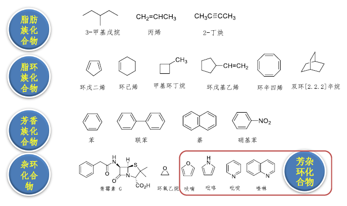{ width="600" }
</figure>

---

**按官能团分类**

**官能团** ：决定化合物的主要性质，反应化合物的主要特征

| 官能团结构 | 官能团名称 | 化合物类型 | 代表化合物 |
| :---: | :---: | :---: | :---: |
| <figure markdown="span">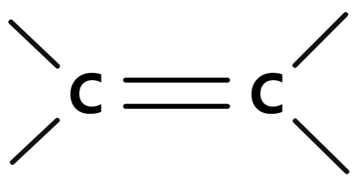{ width="75" }</figure> | 烯基 | 烯烃 | $CH_2=CH_2$ 乙烯 |
| <figure markdown="span">{ width="75" }</figure> | 炔基 | 炔烃 | $HC \equiv CH $ 乙炔 |
| <figure markdown="span">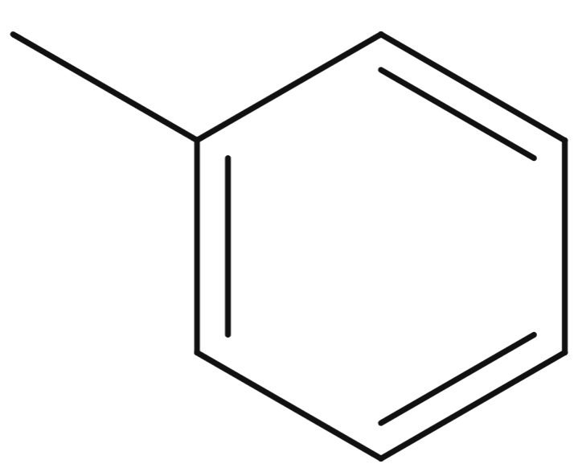{ width="75" }</figure> | 苯基 | 芳香烃 | $C_6H_5CH$ 甲苯 |
| <figure markdown="span">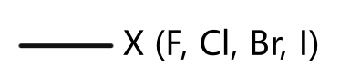{ width="75" }</figure> | 卤素 | 卤代烃 | $CHCl_3$ 氯仿 $C_6H_5Cl$ 氯苯 |
| <figure markdown="span">{ width="75" }</figure> | 羟基 | 醇，酚 | $CH_3OH$ 甲醇 $C_6H_5OH$ 苯酚 |
| <figure markdown="span">{ width="75" }</figure> | 烷氧基 | 醚 | $(CH_3CH_2)_2O$ 乙醚 |
| <figure markdown="span">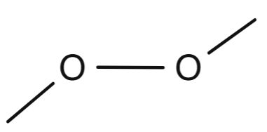{ width="75" }</figure> | 过氧基 | 过氧化物 | $t-BuOOH$ 叔丁基过氧化氢 |
| <figure markdown="span">{ width="75" }</figure> | 巯（$\text{qi\'{u}}$）基 | 硫醇，硫酚 | $CH_3CH_2SH$ 乙硫醇 $C_6H_5SH$ 苯硫酚 |
| <figure markdown="span">{ width="75" }</figure> | 烷硫基 | 硫醚 | $CH_3SCH_3$ 二甲硫醚 |
| <figure markdown="span">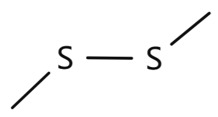{ width="75" }</figure> | 二硫基 | 二硫醚 | $C_6H_5SSC_6H_5$ 二苯基二硫醚 |
| <figure markdown="span">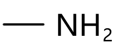{ width="75" }</figure> | 氨基 | 胺（$\text{\`{a}n}$） | $CH_3NH_2$ 甲胺 $C_6H_5NH_2$ 苯胺 |
| <figure markdown="span">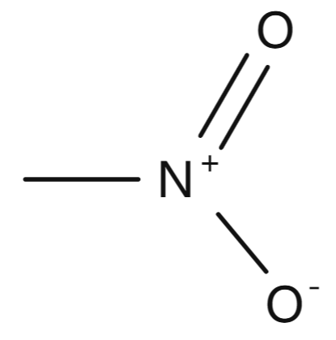{ width="75" }</figure> | 硝基 | 硝基化合物 | $CH_3NO_2$ 硝基甲烷 |
| <figure markdown="span">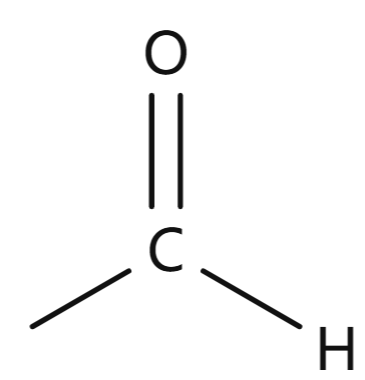{ width="75" }</figure> | 醛基（甲酰基） | 醛 | $CH_3CHO$ 乙醛 |
| <figure markdown="span">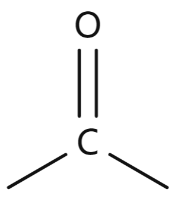{ width="75" }</figure> | 羰基 | 酮 | $CH_3COCH_3$ 丙酮 |
| <figure markdown="span">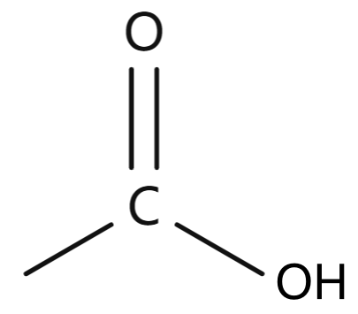{ width="75" }</figure> | 羧基 | 羧酸 | $CH_3COOH$ 乙酸 $C_6H_5COOH$ 苯甲酸 |
| <figure markdown="span">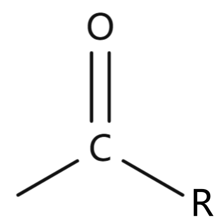{ width="75" }</figure> | 酰卤基 | 酰卤 | $CH_3COCl$ 乙酰氯 |
| <figure markdown="span">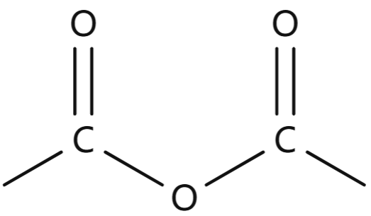{ width="75" }</figure> | 酸酐基 | 酸酐 | $(CH_3CO)_2O$ 乙酸酐 |
| <figure markdown="span">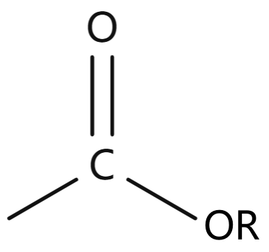{ width="75" }</figure> | 酯基 | 酯 | $CH_3COOCH_2CH_3$ 乙酸乙酯 |
| <figure markdown="span">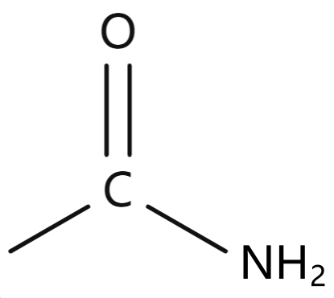{ width="75" }</figure> | 酰胺基 | 酰胺 | $CH_3CONH_2$ 乙酰胺 |
| <figure markdown="span">{ width="75" }</figure> | 氰（$\text{q\'{i}ng}$）基 | 腈（$\text{j\={i}ng}$） | $CH_3CN$ 乙腈 $C_6H_5CN$ 苯甲腈 |
| <figure markdown="span">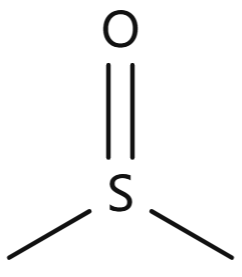{ width="75" }</figure> | 亚砜基 | 亚砜 | $CH_3SOCH_3$ 二甲亚砜 |
| <figure markdown="span">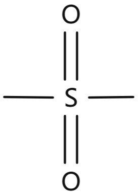{ width="75" }</figure> | 砜基 | 砜 | $CH_3SO_2CH_3$ 二甲砜 |
| <figure markdown="span">{ width="75" }</figure> | 次磺酸基 | 次磺酸 | $C_6H_5SOH$ 苯次磺酸 |
| <figure markdown="span">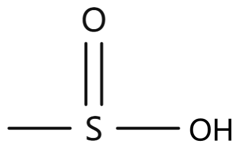{ width="75" }</figure> | 亚磺酸基 | 亚磺酸 | $C_6H_5SO_2H$ 苯亚磺酸 |
| <figure markdown="span">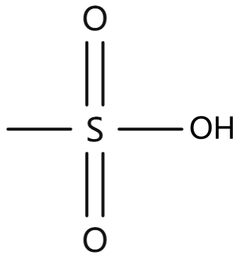{ width="75" }</figure> | 磺酸基 | 磺酸 | $C_6H_5SO_3H$ 苯磺酸 |

## 1.2 共价键

==八隅体规律==

共价键特点：

1. 方向性：两原子轨道必须沿某一方向相互重叠时，重叠程度越大，形成的键越牢固
2. 饱和性：两个原子的未成对电子自旋反平行配对后，再不能与第三个电子配对
3. 定域电子：成键电子只能在轨道重叠的区域内运动

## 1.3 有机化合物结构的表达方式

### 1.3.1 Lewis 结构式

以电子对的形式来表示共价键的分子结构式

<figure markdown="span">
  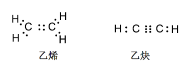{ width="400" }
</figure>

用短线表示成键电子，用“:”表示孤对电子

用“+”和“-”表示原子所带的电荷称为 **式电荷**（FC）

<figure markdown="span">
  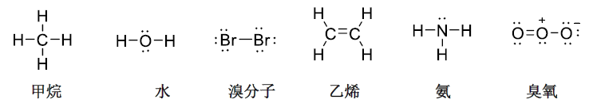{ width="600" }
</figure>

$FC = V - (N + \dfrac{S}{2})$

- V：中性原子的价电子数
- N：分子中该原子的孤对电子数目
- S：成键电子的数目

<figure markdown="span">
  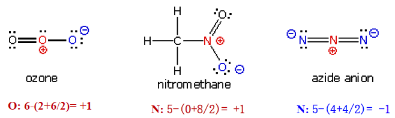{ width="400" }
</figure>

<figure markdown="span">
  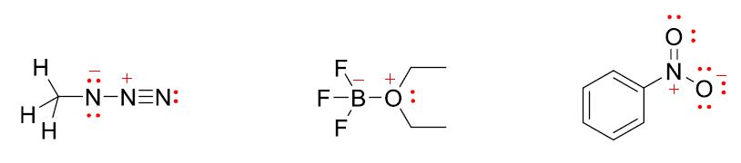{ width="400" }
</figure>

<figure markdown="span">
  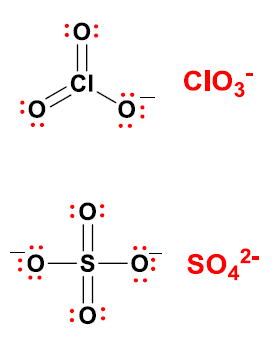{ width="200" }
</figure>

### 1.3.2 $\text{Kekul\'{e}}$ 结构式

省去孤对电子

<figure markdown="span">
  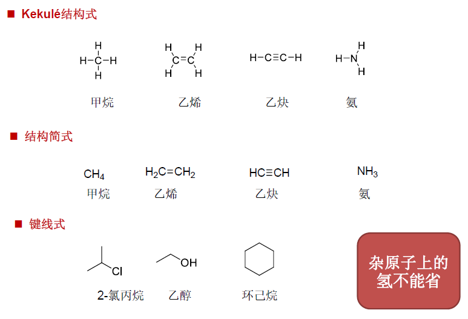{ width="600" }
</figure>

## 1.4 杂化轨道理论

**$sp^3$** 杂化

<figure markdown="span">
  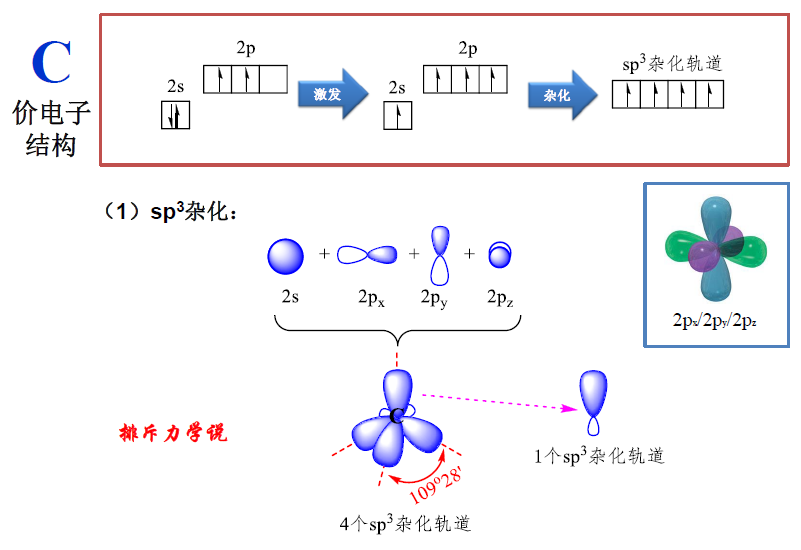{ width="600" }
</figure>

**$sp^2$** 杂化

<figure markdown="span">
  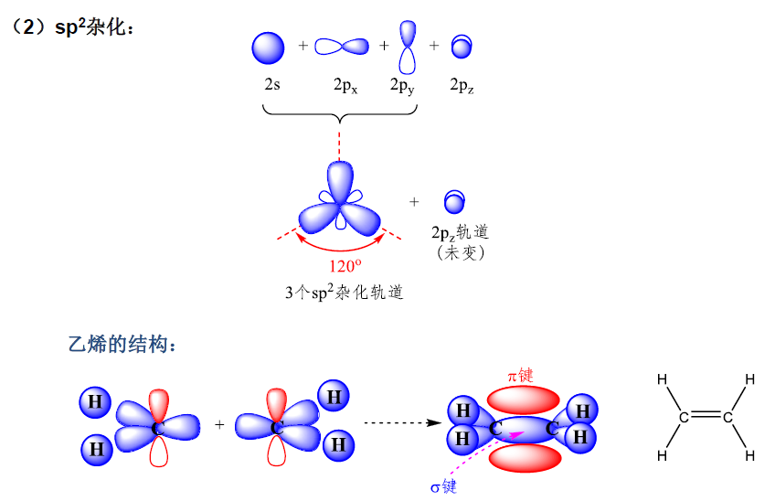{ width="600" }
</figure>

**$sp$** 杂化

<figure markdown="span">
  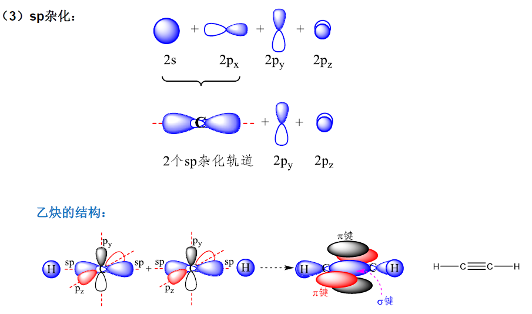{ width="600" }
</figure>

| 杂化类型 | 孤对电子对数量 | 空间构型 | 键角 |
| :--: | :--: | :--: | :--: |
| $sp^3$ | 0 | 四面体 | 109°28′ |
| $sp^3$ | 1 | 三棱锥形 |  |
| $sp^3$ | 2 | V 形 |  |
| $sp^2$ | 0 | 平面三角形 | 120° |
| $sp^2$ | 1 | V 形 |  |
| $sp$ | 0 | 直线形 | 180° |

## 1.5 共价键的键长、键能和键角

### 1.5.1 键长

能量达到波谷时的核间距称为共价键的 **键长**

<figure markdown="span">
  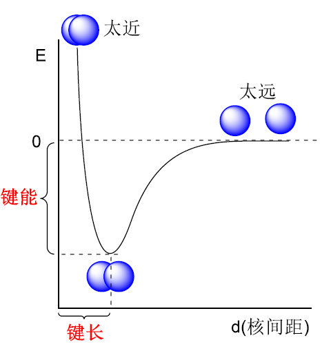{ width="400" }
</figure>

C—C 键长：154 pm

### 1.5.2 键能

气态时均裂一个共价键所需要的能量称为 **键解离能**，**键能** 则是断裂相同类型键的解离能的平均值

### 1.5.3 键角

键与键之间的夹角称为 **键角**

### 1.5.4 分子模型

球棍模型和空间填充模型

<figure markdown="span">
  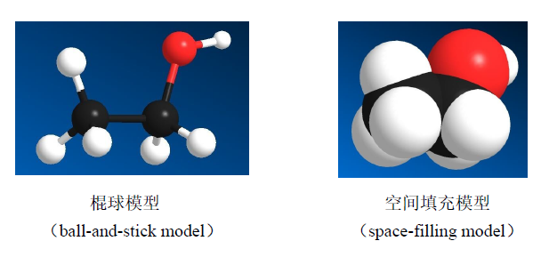{ width="400" }
</figure>

## 1.6 共价键的极性、分子的偶极矩和诱导效应

### 1.6.1 元素的电负性与共价键的极性

**电负性**：吸引电子的能力

<figure markdown="span">
  { width="400" }
</figure>

相同原子形成的共价键，由于其电负性相同，形成 **非极性共价键**。而电负性不同的两个原子，电子云会偏向电负性较大原子的一端，发生 **键的极化**，形成 **极性共价键**。常用 $\delta^+/\delta^-$ 表示极性共价键带电荷的情况，用箭头表示电子对偏移的情况，箭头方向是从带正电原子指向带负电原子

<figure markdown="span">
  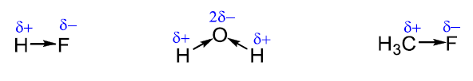{ width="600" }
</figure>

