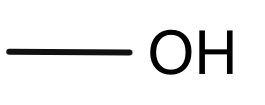
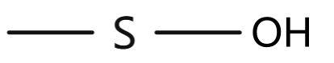

# 1 有机化合物分子结构基础

!!! tip "说明"

    此文档正在更新中……

## 1.1 有机化合物的基本类型

**按碳架分类**

<figure markdown="span">
  { width="600" }
</figure>

---

**按官能团分类**

**官能团** ：决定化合物的主要性质，反应化合物的主要特征

| 官能团结构 | 官能团名称 | 化合物类型 | 代表化合物 |
| :---: | :---: | :---: | :---: |
| <figure markdown="span">{ width="75" }</figure> | 烯基 | 烯烃 | $CH_2=CH_2$ 乙烯 |
| <figure markdown="span">{ width="75" }</figure> | 炔基 | 炔烃 | $HC \equiv CH $ 乙炔 |
| <figure markdown="span">{ width="75" }</figure> | 苯基 | 芳香烃 | $C_6H_5CH$ 甲苯 |
| <figure markdown="span">{ width="75" }</figure> | 卤素 | 卤代烃 | $CHCl_3$ 氯仿 $C_6H_5Cl$ 氯苯 |
| <figure markdown="span">{ width="75" }</figure> | 羟基 | 醇，酚 | $CH_3OH$ 甲醇 $C_6H_5OH$ 苯酚 |
| <figure markdown="span">{ width="75" }</figure> | 烷氧基 | 醚 | $(CH_3CH_2)_2O$ 乙醚 |
| <figure markdown="span">{ width="75" }</figure> | 过氧基 | 过氧化物 | $t-BuOOH$ 叔丁基过氧化氢 |
| <figure markdown="span">{ width="75" }</figure> | 巯（$\text{qi\'{u}}$）基 | 硫醇，硫酚 | $CH_3CH_2SH$ 乙硫醇 $C_6H_5SH$ 苯硫酚 |
| <figure markdown="span">{ width="75" }</figure> | 烷硫基 | 硫醚 | $CH_3SCH_3$ 二甲硫醚 |
| <figure markdown="span">{ width="75" }</figure> | 二硫基 | 二硫醚 | $C_6H_5SSC_6H_5$ 二苯基二硫醚 |
| <figure markdown="span">{ width="75" }</figure> | 氨基 | 胺（$\text{\`{a}n}$） | $CH_3NH_2$ 甲胺 $C_6H_5NH_2$ 苯胺 |
| <figure markdown="span">{ width="75" }</figure> | 硝基 | 硝基化合物 | $CH_3NO_2$ 硝基甲烷 |
| <figure markdown="span">{ width="75" }</figure> | 醛基（甲酰基） | 醛 | $CH_3CHO$ 乙醛 |
| <figure markdown="span">{ width="75" }</figure> | 羰基 | 酮 | $CH_3COCH_3$ 丙酮 |
| <figure markdown="span">{ width="75" }</figure> | 羧基 | 羧酸 | $CH_3COOH$ 乙酸 $C_6H_5COOH$ 苯甲酸 |
| <figure markdown="span">{ width="75" }</figure> | 酰卤基 | 酰卤 | $CH_3COCl$ 乙酰氯 |
| <figure markdown="span">{ width="75" }</figure> | 酸酐基 | 酸酐 | $(CH_3CO)_2O$ 乙酸酐 |
| <figure markdown="span">{ width="75" }</figure> | 酯基 | 酯 | $CH_3COOCH_2CH_3$ 乙酸乙酯 |
| <figure markdown="span">{ width="75" }</figure> | 酰胺基 | 酰胺 | $CH_3CONH_2$ 乙酰胺 |
| <figure markdown="span">{ width="75" }</figure> | 氰（$\text{q\'{i}ng}$）基 | 腈（$\text{j\={i}ng}$） | $CH_3CN$ 乙腈 $C_6H_5CN$ 苯甲腈 |
| <figure markdown="span">{ width="75" }</figure> | 亚砜基 | 亚砜 | $CH_3SOCH_3$ 二甲亚砜 |
| <figure markdown="span">{ width="75" }</figure> | 砜基 | 砜 | $CH_3SO_2CH_3$ 二甲砜 |
| <figure markdown="span">{ width="75" }</figure> | 次磺酸基 | 次磺酸 | $C_6H_5SOH$ 苯次磺酸 |
| <figure markdown="span">{ width="75" }</figure> | 亚磺酸基 | 亚磺酸 | $C_6H_5SO_2H$ 苯亚磺酸 |
| <figure markdown="span">{ width="75" }</figure> | 磺酸基 | 磺酸 | $C_6H_5SO_3H$ 苯磺酸 |

