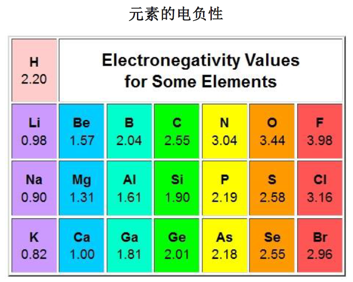
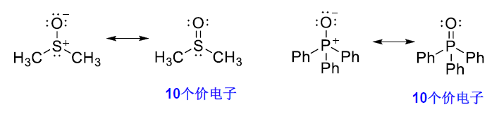

# 1 有机化合物分子结构基础

<!-- !!! tip "说明"

    本文档正在更新中…… -->

!!! info "说明"

    本文档只涉及部分知识点，仅可用来复习重点知识

## 1 有机化合物的基本类型

**按碳架分类**

<figure markdown="span">
  { width="600" }
</figure>

---

**按官能团分类**

**官能团** ：决定化合物的主要性质，反应化合物的主要特征

| 官能团结构 | 官能团名称 | 化合物类型 | 代表化合物 |
| :---: | :---: | :---: | :---: |
| <figure markdown="span">{ width="75" }</figure> | 烯基 | 烯烃 | $CH_2=CH_2$ 乙烯 |
| <figure markdown="span">{ width="75" }</figure> | 炔基 | 炔烃 | $HC \equiv CH $ 乙炔 |
| <figure markdown="span">{ width="75" }</figure> | 苯基 | 芳香烃 | $C_6H_5CH$ 甲苯 |
| <figure markdown="span">{ width="75" }</figure> | 卤素 | 卤代烃 | $CHCl_3$ 氯仿 $C_6H_5Cl$ 氯苯 |
| <figure markdown="span">{ width="75" }</figure> | 羟基 | 醇，酚 | $CH_3OH$ 甲醇 $C_6H_5OH$ 苯酚 |
| <figure markdown="span">{ width="75" }</figure> | 烷氧基 | 醚 | $(CH_3CH_2)_2O$ 乙醚 |
| <figure markdown="span">{ width="75" }</figure> | 过氧基 | 过氧化物 | $t-BuOOH$ 叔丁基过氧化氢 |
| <figure markdown="span">{ width="75" }</figure> | 巯（$\text{qi\'{u}}$）基 | 硫醇，硫酚 | $CH_3CH_2SH$ 乙硫醇 $C_6H_5SH$ 苯硫酚 |
| <figure markdown="span">{ width="75" }</figure> | 烷硫基 | 硫醚 | $CH_3SCH_3$ 二甲硫醚 |
| <figure markdown="span">{ width="75" }</figure> | 二硫基 | 二硫醚 | $C_6H_5SSC_6H_5$ 二苯基二硫醚 |
| <figure markdown="span">{ width="75" }</figure> | 氨基 | 胺（$\text{\`{a}n}$） | $CH_3NH_2$ 甲胺 $C_6H_5NH_2$ 苯胺 |
| <figure markdown="span">{ width="75" }</figure> | 硝基 | 硝基化合物 | $CH_3NO_2$ 硝基甲烷 |
| <figure markdown="span">{ width="75" }</figure> | 醛基（甲酰基） | 醛 | $CH_3CHO$ 乙醛 |
| <figure markdown="span">{ width="75" }</figure> | 羰基 | 酮 | $CH_3COCH_3$ 丙酮 |
| <figure markdown="span">{ width="75" }</figure> | 羧基 | 羧酸 | $CH_3COOH$ 乙酸 $C_6H_5COOH$ 苯甲酸 |
| <figure markdown="span">{ width="75" }</figure> | 酰卤基 | 酰卤 | $CH_3COCl$ 乙酰氯 |
| <figure markdown="span">{ width="75" }</figure> | 酸酐基 | 酸酐 | $(CH_3CO)_2O$ 乙酸酐 |
| <figure markdown="span">{ width="75" }</figure> | 酯基 | 酯 | $CH_3COOCH_2CH_3$ 乙酸乙酯 |
| <figure markdown="span">{ width="75" }</figure> | 酰胺基 | 酰胺 | $CH_3CONH_2$ 乙酰胺 |
| <figure markdown="span">{ width="75" }</figure> | 氰（$\text{q\'{i}ng}$）基 | 腈（$\text{j\={i}ng}$） | $CH_3CN$ 乙腈 $C_6H_5CN$ 苯甲腈 |
| <figure markdown="span">{ width="75" }</figure> | 亚砜基 | 亚砜 | $CH_3SOCH_3$ 二甲亚砜 |
| <figure markdown="span">{ width="75" }</figure> | 砜基 | 砜 | $CH_3SO_2CH_3$ 二甲砜 |
| <figure markdown="span">{ width="75" }</figure> | 次磺酸基 | 次磺酸 | $C_6H_5SOH$ 苯次磺酸 |
| <figure markdown="span">{ width="75" }</figure> | 亚磺酸基 | 亚磺酸 | $C_6H_5SO_2H$ 苯亚磺酸 |
| <figure markdown="span">{ width="75" }</figure> | 磺酸基 | 磺酸 | $C_6H_5SO_3H$ 苯磺酸 |

## 2 共价键

==八隅体规律==

共价键特点：

1. 方向性：两原子轨道必须沿某一方向相互重叠时，重叠程度越大，形成的键越牢固
2. 饱和性：两个原子的未成对电子自旋反平行配对后，再不能与第三个电子配对
3. 定域电子：成键电子只能在轨道重叠的区域内运动

## 3 有机化合物结构的表达方式

### 3.1 Lewis 结构式

以电子对的形式来表示共价键的分子结构式

<figure markdown="span">
  { width="400" }
</figure>

用短线表示成键电子，用“:”表示孤对电子

用“+”和“-”表示原子所带的电荷称为 **式电荷**（FC）

<figure markdown="span">
  { width="600" }
</figure>

$FC = V - (N + \dfrac{S}{2})$

- V：中性原子的价电子数
- N：分子中该原子的孤对电子数目
- S：成键电子的数目

<figure markdown="span">
  { width="400" }
</figure>

<figure markdown="span">
  { width="400" }
</figure>

<figure markdown="span">
  { width="200" }
</figure>

### 3.2 $\text{Kekul\'{e}}$ 结构式

省去孤对电子

<figure markdown="span">
  { width="600" }
</figure>

## 4 杂化轨道理论

**$sp^3$** 杂化

<figure markdown="span">
  { width="600" }
</figure>

**$sp^2$** 杂化

<figure markdown="span">
  { width="600" }
</figure>

**$sp$** 杂化

<figure markdown="span">
  { width="600" }
</figure>

| 杂化类型 | 孤对电子对数量 | 空间构型 | 键角 |
| :--: | :--: | :--: | :--: |
| $sp^3$ | 0 | 正四面体形 | 109°28′ |
| $sp^3$ | 1 | 三角锥形 |  |
| $sp^3$ | 2 | V 形 |  |
| $sp^2$ | 0 | 平面三角形 | 120° |
| $sp^2$ | 1 | V 形 |  |
| $sp$ | 0 | 直线形 | 180° |

## 5 共价键的键长、键能和键角

### 5.1 键长

能量达到波谷时的核间距称为共价键的 **键长**

<figure markdown="span">
  { width="400" }
</figure>

C—C 键长：154 pm

### 5.2 键能

气态时均裂一个共价键所需要的能量称为 **键解离能**，**键能** 则是断裂相同类型键的解离能的平均值

### 5.3 键角

键与键之间的夹角称为 **键角**

### 5.4 分子模型

球棍模型和空间填充模型

<figure markdown="span">
  { width="400" }
</figure>

## 6 共价键的极性、分子的偶极矩和诱导效应

### 6.1 元素的电负性与共价键的极性

**电负性**：吸引电子的能力

<figure markdown="span">
  { width="400" }
</figure>

相同原子形成的共价键，由于其电负性相同，形成 **非极性共价键**。而电负性不同的两个原子，电子云会偏向电负性较大原子的一端，发生 **键的极化**，形成 **极性共价键**。常用 $\delta^+/\delta^-$ 表示极性共价键带电荷的情况，用箭头表示电子对偏移的情况，箭头方向是从带正电原子指向带负电原子

<figure markdown="span">
  { width="600" }
</figure>

当两个原子的电负性差值大于等于 2 时，可以发生电子的转移，形成 **离子键**

<figure markdown="span">
  { width="600" }
</figure>

衡量共价键的极性大小用 **键矩** —— 键的偶极矩，用符号 $\mu$ 表示。正、负电荷中心的距离 $d$，正或负电荷 $q$，$\mu = d \times q$，单位是 $D$ （德拜）

键矩是一矢量，方向通常规定为由正到负，用符号 { width="20" } 表示，箭头指向带负电荷原子的一端

电负性差值越大，键矩越大

杂化轨道中 s 成分越多，对核外电子的束缚力越大，因此，不同杂化轨道碳原子的电负性大小顺序为：$C_{sp} > C_{sp^2} > C_{sp^3}$

### 6.2 分子的偶极矩

分子的偶极矩是各键矩的矢量和。矢量和为 0 是非极性分子，不为 0 是极性分子

<figure markdown="span">
  { width="600" }
</figure>

分子的极性导致整个分子电子云密度分布不均匀。一种直观的表示分子中各区域电子云密度分布情况的方法称为 **静电势图**。颜色深浅表示势能的高低

<figure markdown="span">
  { width="600" }
</figure>

### 6.3 诱导效应

原子的电负性不同导致分子中电子密度分布不匀，使整个分子发生极化，这种效应称为 **诱导效应**，用 $I$ 表示

<figure markdown="span">
  { width="600" }
</figure>

诱导效应是一种由于原子电负性不同引起的静电作用，是永久性的。其特征是电子云发生偏移沿着 $\sigma$ 键传递，并随着碳链的增长而迅速减弱或消失

通常以 C - H 键中的氢原子为标准：$Ι = 0$，原子或基团的吸电子能力比氢强，则其具有吸电子诱导效应（用 $-I$ 表示），原子或基团的吸电子能力比氢弱，则其具有给电子诱导效应（用 $+I$ 表示）

一些常见原子（或基团）的吸电子诱导作用相对顺序：

$$
NH_3^+ > NO_2 > SO_2R > CN > SO_3H > CHO > CO > COOH > COCl > CONH_2 > \\
F > Cl > Br > I > OH > OR > NR_2 > NH_2 > C_6H_5 > CH=CH_2 > H
$$

一些常见原子（或基团）的给电子诱导作用相对顺序：

$$
O^- > COO^- > CH_3 > D (氘) > H
$$

诱导效应能够改变分子的物理性质和化学性质

<figure markdown="span">
  { width="600" }
</figure>

## 7 分子轨道理论

**分子轨道理论**（MO 理论）：原子轨道是描述原子中电子运动的状态函数，用 $\phi$ 来表示。分子轨道是描述整个分子中电子运动的状态函数，用 $\Psi$ 来表示。原子轨道波函数各乘以某一系数相加或相减，得到分子轨道波函数。组合时原子轨道对分子轨道的贡献体现在系数上，组合前后轨道总数不变。如果两个符号相同（即相位相同）的原子轨道波函数相加，得到的分子轨道能量比原子轨道能量低，称为 **成键轨道**，用 $\Psi$ 表示。如果相减，则得到的分子轨道犹如波峰和波谷相遇而相互减弱一样，中间出现 **节面**，电子出现在节面上的概率为零，这样的分子轨道比原子轨道能量高，称为 **反键轨道**，用 $\Psi^*$ 表示

<figure markdown="span">
  { width="500" }
</figure>

<figure markdown="span">
  { width="600" }
</figure>

**休克尔分子轨道法**（HMO）

<figure markdown="span">
  { width="500" }
</figure>

成键三原则：

1. 只有对称性相同的原子轨道，即“对称匹配”，才能有效成键
2. 只有能量相近的原子轨道，才能有效成键
3. 原子轨道重叠程度越大，形成的键越牢固

分子轨道理论认为：成键电子不是“定域”在成键轨道中，而是在整个分子内运动，即是“离域”的。这也是价键理论与分子轨道理论最根本的区别

## 8 共轭体系和共轭效应

### 8.1 $p \text{-} p$ 共轭

羰基中的碳氧双键，成键轨道上的 2 个电子更偏向氧原子。这种电子偏向某一个原子的运动，称为 $\pi$ 电子的 **离域**，==电子离域只能在共轭体系中进行==。羰基的 $\pi$ 键由 $p \text{-} p$ 轨道形成，称为 $p \text{-} p$ 共轭

### 8.2 $p \text{-} \pi$ 共轭

如果与 $\pi$ 键相连的原子具有一个与 $\pi$ 键平行的 $p$ 轨道，那么这个 $p$ 轨道就可与 $\pi$ 键共轭，形成 $p \text{-} \pi$ 共轭体系

<figure markdown="span">
  { width="600" }
</figure>

### 8.3 $\pi \text{-} \pi$ 共轭

两个 $\pi$ 键通过一个单键相连形成的共轭称为 $\pi \text{-} \pi$ 共轭。$\pi \text{-} \pi$ 共轭体系可以完全由碳原子组成，也可以由碳原子和其他原子共同组成。只要是两个不饱和键通过一个单键相连，就可以形成 $\pi \text{-} \pi$ 共轭体系

<figure markdown="span">
  { width="600" }
</figure>

共轭体系的特点：

1. 共轭使得参与共轭的共价键的键长趋于平均化
2. 由于电子优先填充到能量更低的成键轨道上，因此体系的能量下降，稳定性增加

### 8.4 共轭效应

- 常见给电子共轭效应（+C）的基团：$OH, OR, SH, SR, NH_2, NHR, NR_2, O^-, X$
- 常见吸电子共轭效应（-C）的基团：$C=O, NO_2, CN$

## 9 共振理论

### 9.1 共振结构与共振杂化体

**共振结构**：每个 Lewis 结构式代表一种极限结构

**共振杂化体**：所有共振结构的加权平均形式

<figure markdown="span">
  { width="600" }
</figure>

### 9.2 共振结构的书写

1.共振结构之间用双箭头联系。共振杂化体比任何一个共振结构都稳定

2.共振的本质是共轭体系中电子的离域，即电子的合理运动。共轭体系上的电子可以离域。离域电子发生合理的离域运动，原子核的相对位置不能改变，即骨架不变。一对电子的离域用弯箭头 $\curvearrowright$ 表示，单个电子的离域用鱼钩 { width="25" } 表示。用虚实线表示键长平均化，用 $\delta^+$ 和 $\delta^-$ 表示原子所带的相对电荷密度

<figure markdown="span">
  { width="400" }
</figure>

3.所有共振结构中的原子必须符合价键理论的规则。但对于第三、四周期的元素来说，八隅体规则可能并不适用

<figure markdown="span">
  { width="600" }
</figure>

<figure markdown="span">
  { width="600" }
</figure>

<figure markdown="span">
  { width="600" }
</figure>

4.所有共振结构中的净电荷数必须相同

<figure markdown="span">
  { width="600" }
</figure>

5.所有共振结构体中的未成对电子数必须相同

<figure markdown="span">
  { width="600" }
</figure>

6.$\pi$ 电子从富电性原子向缺电性原子偏移

<figure markdown="span">
  { width="600" }
</figure>

7.书写共振式时，需要满轨道方向性的要求

<figure markdown="span">
  { width="600" }
</figure>

!!! tip "书写共振式"

    1. [有机化学2.2：共振式书写无敌攻略](https://www.bilibili.com/video/BV1yT411w7Hf/){:target="_blank"}
    2. [有机化学2.3：共振论的书写和共振论的应用](https://www.bilibili.com/video/BV1it4y1g7sr/){:target="_blank"}

    > 我超，这个视频太牛啦啦啦啦啦啦，不会写的赶紧去看啊啊啊啊啊啊

### 9.3 共振稳定作用

1. 共振结构越稳定，对共振杂化体贡献越大  
2. 共振杂化体的内能低于任何单个共振结构的内能
3. 参加共振的结构越多，共振杂化体越稳定
4. 共价键越多越稳定
5. 具有八隅体结构的原子越多越稳定
6. 形式电荷越接近 0 越稳定，电荷分离将导致稳定性降低
7. 键角和键长变形较大的共振式极不稳定

<figure markdown="span">
  { width="600" }
</figure>

<figure markdown="span">
  { width="600" }
</figure>

## 10 分子间弱的作用力

### 10.1 范德华力

分子之间存在非定向的、无饱和性的、较弱的相互吸引的作用力

范德华力的大小会影响有机化合物的熔点、沸点和密度等物理性质

类型：

1. 非离子型的极性分子具有永久偶极矩，它们之间存在 **偶极-偶极相互作用力**，也称为 **取向力**
2. 极性分子堆非极性分子有极化作用，使非极性分子的电子云变形，产生诱导偶极矩，永久偶极矩与其诱导出的瞬间偶极矩相互作用。这种偶极-诱导偶极相互作用力称为 **诱导力**
3. 非极性分子之间由于电子的概率运动，可以相互配合产生一对方向相反的诱导偶极矩，这种诱导偶极-诱导偶极相互作用力称为 **色散力** 或 **伦敦力**，它是范德华力的主要来源。色散力与分子的变形性有关，可变形性越强越易被极化，色散力也越强

非极性分子：随分子量增大，原子半径增大，电子增多，分子变形性增加，因此色散力增大，分子间力增强

<figure markdown="span">
  { width="600" }
</figure>

### 10.2 氢键

$X \text{---} H \text{- - -} Y$

由于 $H$ 的电负性小，公家电子通常偏向于 $X$，使得 $H$ 缺电子。若与电负性大的原子 $Y$ 接近，$Y$ 的孤对电子则可以补充到缺电子的 $H$ 原子上

- 含 Y 的分子称为氢键受体（或质子受体）
- 含 $X \text{---} H$ 的分子称为氢键给体（或称质子给体）
- $H \text{- - -} Y$ 则为氢键，其强度随 $X$ 电负性的增加而增加
- $X$ 和 $Y$ 通常为 $F$、$O$、$N$ 原子

氢键比共价键弱，但比范德华力强。它具有饱和性和方向性

氢键对有机化合物的熔点、沸点、溶解度、密度等物理性质的影响比较大