# 2 脂肪烃和脂环烃

!!! tip "说明"

    此文档正在更新中……

!!! info "说明"

    本文档只涉及部分知识点，仅可用来复习重点知识

<figure markdown="span">
  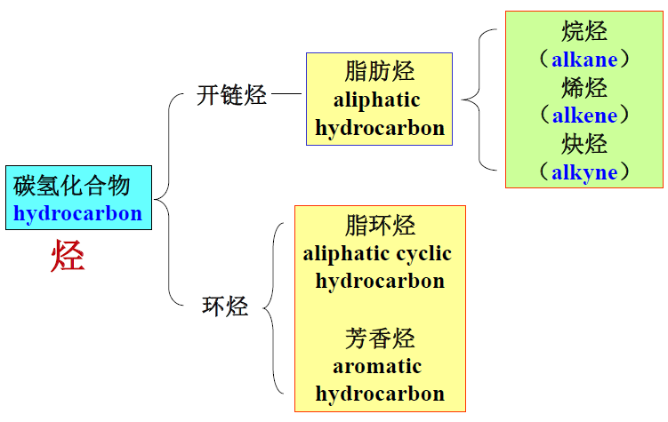{ width="600" }
</figure>

## 2.1 脂肪烃的分类和构造异构

### 2.1.1 脂肪烃的分类和同系列

1. **烷烃**，也称 **饱和烃**，$C_nH_{2n+2}$
2. **烯烃**
      1. 单烯烃，不饱和度为 1，$C_nH_{2n}$
      2. 二烯烃，不饱和度为 2，$C_nH_{2n-2}$
      3. 多烯烃
3. **炔烃**，$C_nH_{2n-2}$（只含一个碳碳叁键）

烯烃和炔烃又称 **不饱和烃**，其碳碳键又称为 **不饱和键**

### 2.1.2 脂肪烃的构造异构

**同分异构体**：分子式相同而结构不同的化合物

- **构造异构**：由于分子中各原子的连接方式和连接顺序不同产生的异构现象
    - **骨架异构**：由于碳的连接顺序不同而产生的
    - **官能团位置异构**：由于官能团在碳链中的位置不同而产生的
    - **官能团异构**：由于官能团的不同而产生的

<figure markdown="span">
  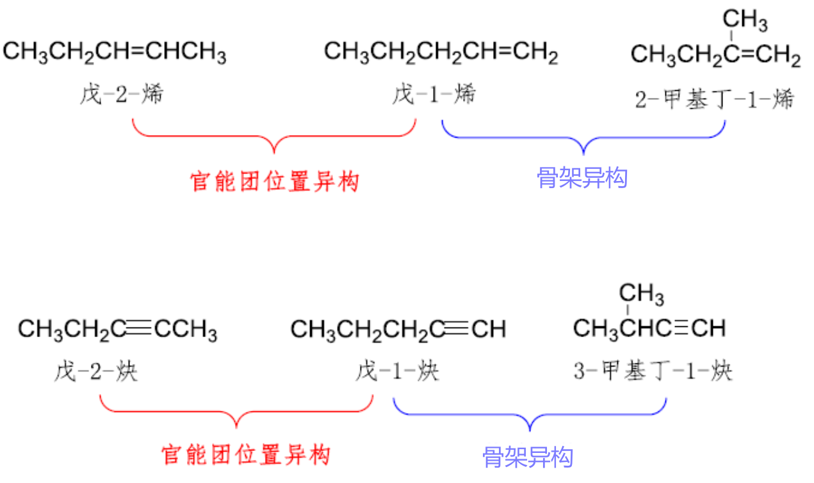{ width="600" }
</figure>

<figure markdown="span">
  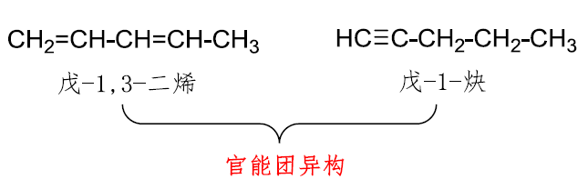{ width="600" }
</figure>

## 2.2 脂肪烃的命名

> 对不起 🙇🏻‍♂️，上课的时候，看到这一坨命名规则给我看笑了，无恶意，就是感觉化学家在面对给一大堆有机化合物命名这一“简单”问题时的无力感 😂

### 2.2.1 直链烷烃、烯烃和炔烃的命名

碳数 +（碳）烷（后缀）

- 10 个碳以内用天干表示：甲乙丙丁戊己庚辛壬癸
- 11 个及以上碳用数字表示

超过十个碳的不饱和烃不能省略“碳”

<figure markdown="span">
  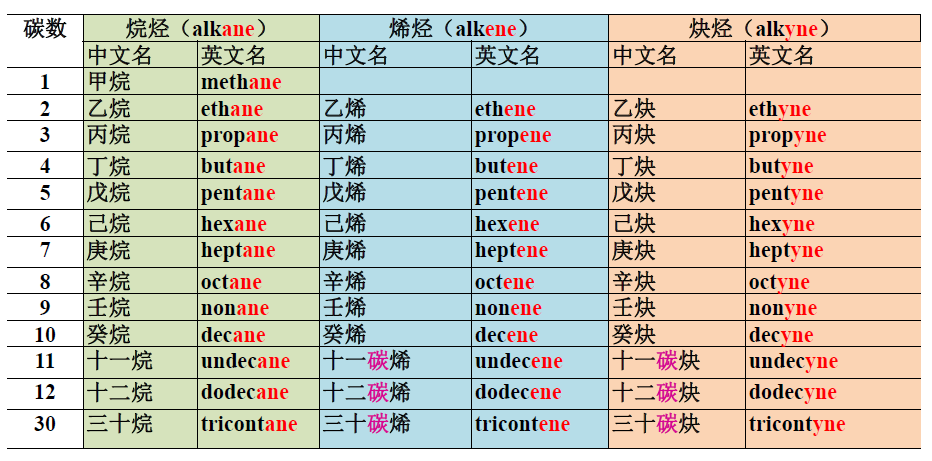{ width="600" }
</figure>

### 2.2.2 支链脂肪烃的命名

- “正” (n-)：直链
- “异” (iso-)：$(CH_3)_2CH -$ 或 $(CH_3)_2C =$，两只脚
- “新” (neo-)：$(CH_3)_3C -$，三只脚

<figure markdown="span">
  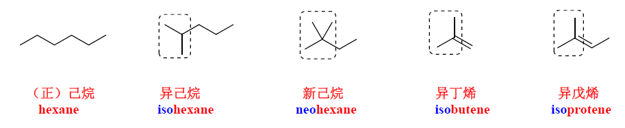{ width="600" }
</figure>

取代基名（前缀）+ 主链（母体）名（后缀）

#### 2.2.2.1 取代基的命名

烷烃去掉一个氢原子后剩余部分称为 **烷基**

<figure markdown="span">
  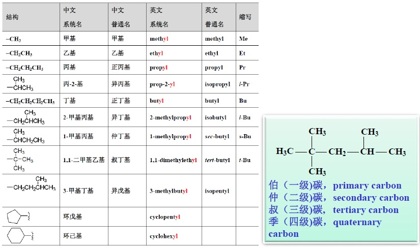{ width="800" }
</figure>

烯烃和炔烃去掉一个氢原子后的基团分别称为 **烯基** 和 **炔基**。烃类分子去掉一个氢原子后剩余的部分统称为基或 **取代基**

<figure markdown="span">
  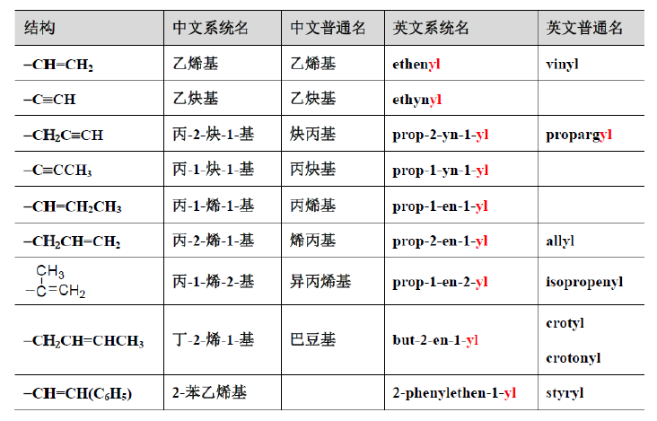{ width="600" }
</figure>

<figure markdown="span">
  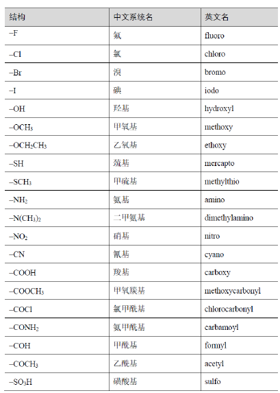{ width="600" }
</figure>

烷烃中同时去掉两个氢原子后剩余的基团称为叉基和亚基

- 叉基：氢来自于 $sp^3$ 碳
    - 两个氢来自于同一个碳
    - 两个氢来自于不同的碳
- 亚基：氢来自于同一个 $sp^2$ 碳

必须标明去掉氢原子的位置（除非没有同分异构体）

<figure markdown="span">
  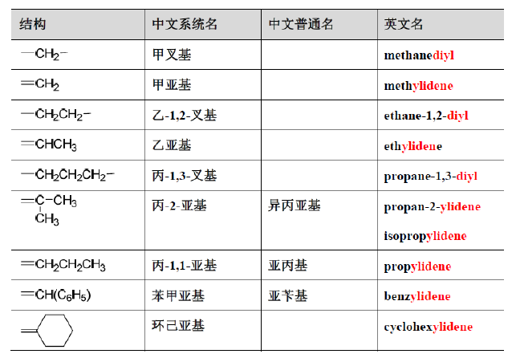{ width="600" }
</figure>

#### 2.2.2.2 脂肪烃的命名

1. 确定主链
      1. 碳链最长
      2. 重键最多
      3. 双键最多
      4. 重键位次组最低
      5. 双键位次组最低
      6. 取代基最多
      7. 取代基位次组最低
      8. 取代基英文名排序
2. 主链编号
      1. 重键位次最低
      2. 重键位次组最低
      3. 双键位次最低
      4. 取代基位次最低
      5. 取代基位次组最低
      6. 取代基英文名排序
      7. 取代基位次排序
3. 命名：取代基名（前缀）+ 主链烷烃名（后缀）

## 2.3 脂肪烃的结构和顺反异构

### 2.3.3 烯烃构型的命名

#### 2.3.3.1 顺/反命名法

两个碳上连有一对相同基团

<figure markdown="span">
  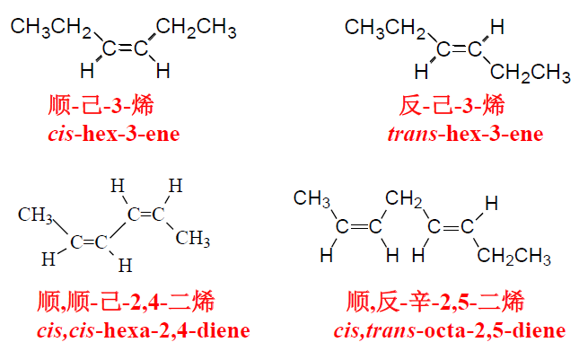{ width="600" }
</figure>

#### 2.3.3.2 次序规则

两个双键碳上有 3 个或 4 个不同的基团

五条基本规则：

1. 原子序数大的优先于原子序数小的
2. 原子质量高的优先原子质量低的
3. 顺优先于逆，Z 优先于 E
4. R 优先于 S，M 优先于 P，r 优先于 s
5. R，R 或 S，S 优先于 R，S 或 S，R

树状图

含有双键和叁键的基团，可采用“复制原子”和“假想原子”

对于环系基团，可将环处理为分叉的原子链，链的两端均延伸至分叉的端点，并将此作为连有假想原子的复制原子

#### 2.3.3.3 Z/E 命名法

<figure markdown="span">
  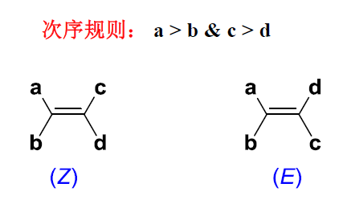{ width="400" }
</figure>

## 2.6 脂环烃的命名

