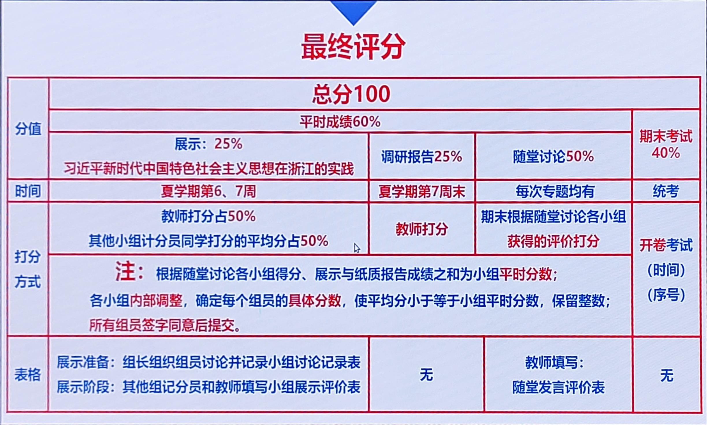

# 习近平新时代中国特色社会主义思想概论

!!! tip "说明"

    本文档正在更新中……

## 课程介绍

!!! info "注意"

    此为 2024-2025 春夏学期课程安排，仅供参考

zxq老师、sjq老师

### 考核方式

“习概”学生手册

404 KB | 11 page

<a class="hq-down-button" target="_blank" href="../../../file/xi_thought/xi_thought_doc1.pdf" markdown="1">:fontawesome-solid-download: 下载</a>

每旷课一次在总成绩中扣 5 分

实践教学研究方向示例：

1. 中国革命红船起航地
2. 改革开放先行地
3. 习近平新时代中国特色社会主义思想重要萌发地
4. 努力建设新时代全面展示中国特色社会主义制度优越性的重要窗口
5. 在高质量发展中奋力推进中国特色社会主义共同富裕先行和省域现代化先行

#### 评分方式

<figure markdown="span">
  { width="600" }
</figure>

#### 期末考试

##### 考试类型

开卷，可以查看纸质材料及手写笔记

##### 考试题型

5 道主观题

##### 考试资料

1. 统编教材《习近平新时代中国特色社会主义思想概论》，本书编写组，高等教育出版社、人民出版社
2. 《习近平新时代中国特色社会主义思想学习纲要（2023年版）》，中共中央宣传部，学习出版社、人民出版社
3. 《中共中央关于进一步全面深化改革、推进中国式现代化的决定》
4. 关于《中共中央关于进一步全面深化改革、推进中国式现代化的决定》的说明

## 笔记

### 个人笔记

使用 Xmind 将课本和三十讲的知识点整理成了思维导图，知识点后标有课本页码，课本上找不到的就是三十讲中的

课本_三十讲

379 KB | 6 page

<a class="hq-down-button" target="_blank" href="../../../file/xi_thought/xi_thought_doc2.pdf" markdown="1">:fontawesome-solid-download: 下载</a>

Xmind 原文件：[课本_三十讲](../../file/xi_thought/xi_thought_doc3.xmind){:target="_blank"}

### 其他

> 资料来源：[习概三十讲，思维导图](https://www.cc98.org/topic/5300792){:target="_blank"}

1. [三十讲](../../file/xi_thought/xi_thought_doc4.pdf){:target="_blank"}
2. [三十讲思维导图](../../file/xi_thought/xi_thought_doc5.pdf){:target="_blank"}

## 历年题整理

### 2024-2025 秋冬

[2024-2025秋冬习概回忆卷(完整)](https://www.cc98.org/topic/6084454){:target="_blank"}

### 2023-2024 春夏

[23—24春夏学期习概回忆卷](https://www.cc98.org/topic/5919891){:target="_blank"}

### 2023-2024 秋冬

[2023—2024习概回忆卷](https://www.cc98.org/topic/5798627){:target="_blank"}

### 2020-2021 秋冬

[习概 20-21 冬学期 回忆卷](https://www.cc98.org/topic/5023424){:target="_blank"}

## 个人感受

